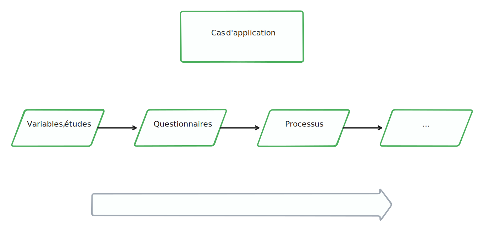
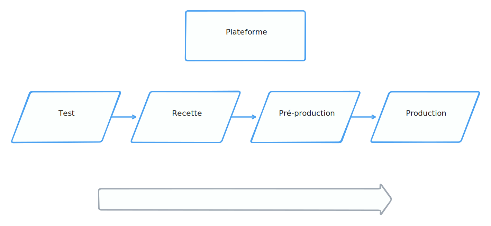

# Constances

## Réunion du 13 janvier 2024

Note:
Dire bonjour :)

---

## Épisodes précédents

----

- Commande initiale : prise de connaissance
- MAPA : expérimentation et première approche stratégique

----

### Premiers enseignements

- Faisabilité de DDI
    - spécification des concepts
    - distinction questions / variables
- Intérêt d'une approche globale FAIR
- Utilité des standards
    - Exemple : GSBPM
- Apport de l'IA (LLM)
- Synergies à entretenir (CASD, GIDE, ANS, FC...)

----

### Premiers enseignements (organisation)

- Positif
    - expertise des correspondants
    - bon contact entre les équipes
- Moins positif
    - Multiplicité des acteurs
    - Difficile d'identifier les bons interlocuteurs
    - Maîtrise des délais de réponse

---

## Bilan MAPA

&#x1F449; [rapport final](https://github.com/Making-Sense-Info/Suivi-Constances/blob/main/ms13/livrables/ms13-d8.md)

----

### Les prestations

- Plan d'Assurance Qualité
- Dossier d'état des lieux
- Référentiel d'interopérabilité
- Dix prototypes
- Plan de standardisation
- Dossier de réversibilité
- Rapport final

----

### Focus

- [Référentiel d'intéropérabilité](https://github.com/Making-Sense-Info/Suivi-Constances/blob/main/ms13/livrables/ms13-d3.md) (Franck),
- Prototypes
  - [Provenance](https://github.com/Making-Sense-Info/Suivi-Constances/blob/main/ms13/livrables/ms13-p4/ms13-p4-p2.md) (Nico)
  - [LLMs](https://github.com/Making-Sense-Info/Suivi-Constances/blob/main/ms13/livrables/ms13-p4/ms13-p4-p6.md) (-> Kilimandjaro), 
  - [OMOP](https://github.com/Making-Sense-Info/Suivi-Constances/blob/main/ms13/livrables/ms13-p4/ms13-p4-p7.md) (Romain)

----

### Vision GSBPM

&#x1F449; [Le GSBPM](https://statswiki.unece.org/spaces/GSBPM/pages/113083140/Clickable+GSBPM+v5.1)

----

- **Conception**, **Construction**, 
  - DDI-Lifecycle documente les instruments de collecte et les jeux de données externes (SNDS),
  - autres standard (SSN pour les examens des CES) ;
- **Collecte**
  - rétro documentation des questionnaires existants
  - production des questionnaires à partir du modèle DDI ?

----

- **Traitement** 
  - DDI-L voire CDI pour les variables dérivées et les agrégats  
  - VTL a un rôle à jouer comme spécification exécutable (+ autres standards pour la provenance) ;
- **Diffusion**
  - les outils de catalogage + DCAT (prototype 3)
  - standards de la médecine (FHIR)

---

## Mekong

Construction d'un SI DDI Lifecycle

---

## La vision stratégique

----

- rendre les métadonnées actives
- mettre l’utilisateur au centre
- développer l'ouverture

----

### Rendre les métadonnées actives

----

----

### Mettre l'Utilisateur au centre

- Identifier les *u*tilisateurs
- Les associer au projet (communication, démo, etc.)

----

### Développer l'ouverture

- Collaboration internationale
- Communication ouverte vers l'extérieur
- Solutions et développements open source

---

## Les grandes étapes

----

- Mise en place des fondations
- Définition et priorisation des cas métiers
- Construction de la plateforme
- Formations
- Communication
- ... le tout en parallèle tout au long des quatre ans

----

----

----

----

----

---

## Les fondations

----

### Le Plan d'Assurance Qualité

 - Un [document](https://github.com/Making-Sense-Info/Suivi-Constances/tree/main/ms23/paq) décrivant nos modalités d'organisation
 - Une base pour démarrer notre collaboration...
 - ...qui doit rester vivante

----

### Périmètre

----

### Périmètre &#128172; 

- Briques élémentaires
    - Concepts, variables, listes de codes, études
- Éléments verticaux
    - Questionnaires, tables, jeux de données
- Éléments horizontaux
    - Processus, traitements
- ...et les standards associés

----

### L'architecture

- Objectifs
    - définir le cycle de vie de la métadonnée,
    - définir le ou les référentiels,
    - identifier les points d’interaction avec le reste du système d’information de Constances,
    - proposer les solutions logicielles adaptées.
- Utilisation de standards

---

## Le plan de standardisation

----

### Cas d'application FAIR

Des cas d'utilisation métier x des cibles de standardisation.

----

#### Objectif

> Décrire les exigences fonctionnelles d’un système en adoptant le point de vue et le langage de l’utilisateur
final

----

#### Exemple

> Documenter les variables des questionnaires en DDI Lifecycle.

> Documenter le processus lié au SNDS en DDI CDI

----

#### Priorisation &#128172;

- la documentation des études et séries d’étude
- la collecte par questionnaire*
- la collecte des données cliniques et leur transmission à la biobanque
- l’acquisition et l’intégration de données externes
- la transformation des données
- la mise à disposition auprès des équipes de recherche
- le suivi de la qualité

---

## La formation

----

- Cycle régulier à mettre en place
  - Coller aux cas d'application
- Formations et supports par Making Sense
- 1ère proposition
  - DDI Lifecycle, introduction (mai 2025 ?)
  - DDI Lifecycle, avancé (septembre 2025 ?)
  - Web sémantique et standards associés (début 2026)
  - DDI CDI, VTL (courant 2026)

---

## La communication

----

### Présentation du projet 

- Webinaires réguliers
  - Identifier le public, les canaux de communication
- Conférence
  - EDDI, comité Constances ?, club utilisateurs, etc.

----

### Collaborations

- Cohortes (FC, Closer)
- Initiatives FAIR

---

## L'organisation

----

- les rôles
- les réunions
- la documentation du projet
- les livrables

----

### Les rôles

&#x1F449; [PAQ](https://github.com/Making-Sense-Info/Suivi-Constances/tree/main/ms23/paq#organisation-générale)

----

### Les réunions régulières

- un comité stratégique semestriel &#x1F3E2;
- un comité de pilotage mensuel &#x1F3E2; / &#x1F5A5; 
- un point hebdomadaire de suivi &#x1F5A5; 

&#x1F449; [PAQ](https://github.com/Making-Sense-Info/Suivi-Constances/tree/main/ms23/paq#typologie-des-réunions)

----

### Le suivi du projet

&#x1F449; [Inspiration agilité](https://github.com/Making-Sense-Info/Suivi-Constances/tree/main/ms23/paq#suivi-de-projet)

----

### La documentation du projet

- Dans le dépôt Github
  - compte rendus,
  - documents de travail,
  - outil de suivi (Kanban), 
    - suivi des temps ?

----

### Les livrables &#128172;

- documents, supports de formation, notes d'installation
- code, configuration

---

## Prochaines étapes

- Point administratif
- Mise en place de l'organisation (PAQ)
- Prochains comités
- Constitution du périmètre