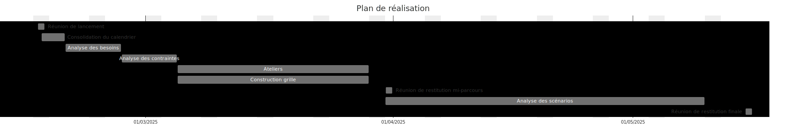

# RIDEA

Réunion de pré-lancement 🤔

---

## Agenda

----

- Présentations
- Compréhension du besoin et des délais
- Les acteurs
- Le plan de réalisation
- Les scénarios
- Les évolutions

---

## Making Sense

----

[Nos activités](https://www.making-sense.info/activities) :
- conseil en métadonnées (construction de SI, choix des standards)
- développement autour des standards
- formation

---

## Notre compréhension

----

- Du besoin
  - RICA vers RIDEA
  - déterminer la solution de collecte (cf. les scénarios)
  - dans un contexte stratégique établi
- Des délais
  - preuve d'un système RIDEA fin 2027
  - collecte sur 2028 en 2029
  - qualification du scénario S1 2025 

---

## Les acteurs

----

- Le BPSCA / Pôle RICA
- Le BQIS
- Les offices comptables
- Les SRISE
- Les exploitants agricoles
- Le SNUM
- L'Insee (unité OSE)

Note:
Pôle RIDEA ? :)

---

## Le plan de réalisation

----

----

---

## Les scénarios

----

Liste initiale :
  - Capibara - Filière (CF)
  - Filière uniquement (FU)
  - Développement spécifique (DS)

----

Des questions :
- Capibara ?
- Filière : a priori impossible pour la collecte de données comptables ?
- Solution propriétaire hébergée : confidentialité / sécurité ?

---

## Les évolutions

----

- Maintien et enrichissement du questionnement actuel (nouveaux contrôles, nouvelles variables, nouvelles données externes) 🟢
- Nouvelle enquête auprès des exploitants (protocole à définir) 🟢
- API pour collecter les données des logiciels comptables 🟠
- Récupération données administratives 🟠
- Expertise nouvelles sources de données 🟠
- Restitution aux participants

➡️ Priorisation ? Impact ?

Note:
Les 🟠 dans le halo du projet, quel(s) impact(s) ?