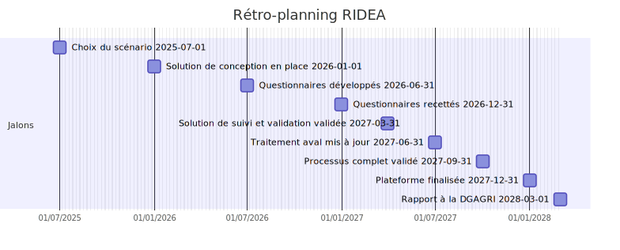
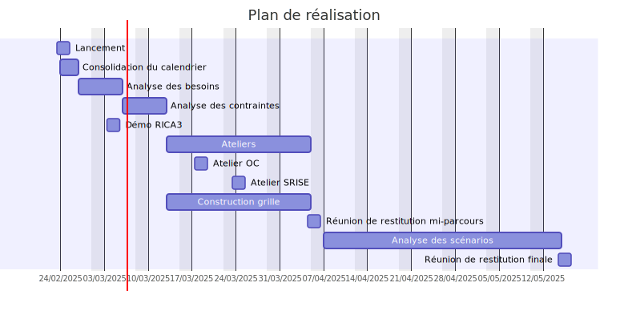

# RIDEA

**Quelle solution de collecte ?**

Réunion de lancement - *7/3/2023*

---

## Agenda

----

- Compréhension du besoin
- Acteurs du projet
- Scénarios
- Plan de réalisation
- Point d'étape

---

## Notre compréhension

----

- Du besoin
  - RICA vers RIDEA
  - Déterminer la solution de collecte (les scénarios)
  - Dans un contexte stratégique établi (Corn)
- Des délais
  - Collecte sur 2028 en 2029
  - Preuve d'un système de collecte RIDEA fin 2027
  - Choix du scénario fin du S1 2025 

Note:
European Green deal, Farm to fork
- Maintien et enrichissement du questionnement actuel (nouveaux contrôles, nouvelles variables, nouvelles données externes)
- Nouvelle enquête auprès des exploitants (protocole à définir)

----

---

## Les acteurs

----

- Le BPSCA / Pôle RICA
- Le BQIS
- Les offices comptables
- Les SRISE
- Les exploitants agricoles*
- Le SNUM
- L'Insee (unité OSE)

Note:
Pôle RIDEA ? :)
Les exploitants sont les seuls qu'on ne rencontrera pas 

---

## Les scénarios

----

Liste initiale :
  - Capibara - Filière (CF)
  - Filière uniquement (FU)
  - Développement spécifique (DS)

Mais ⬇

----

- Capibara n'est qu'une solution temporaire (programme Soror)
- Il faut également étudier des solutions du marché
  - Sélection d'un sous-ensemble

Note:
Éléments discutés et validés lors de la réunion du 5/2
Forsta mais aussi Qualtrics, Gide ? 
Localisation des données ?

----

Liste retenue :
  - Filière Insee (FI)
  - Développement spécifique (DS)
  - Solution du marché (SM)

Note:
Et un mix de ces solutions

---

## Le plan de réalisation

----

Note:

--> Recueil d'exigences
--> Grille d'analyse

- Pertinence fonctionnelle (Questionnement, Suivi, Validation)
  - Pondération ?
- Adéquation stratégique (Corn)
- Faisabilité (Temporelle, Organisationnelle, Technique)
- Risques
- Coûts

----

---

## Point d'étape

----

- Analyse de l'existant
  - Travail documentaire
  - Démonstration de l'application
- Finalisation du calendrier
  - Ateliers à fixer
  - Réunions de restitution