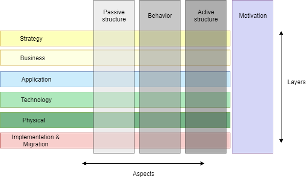
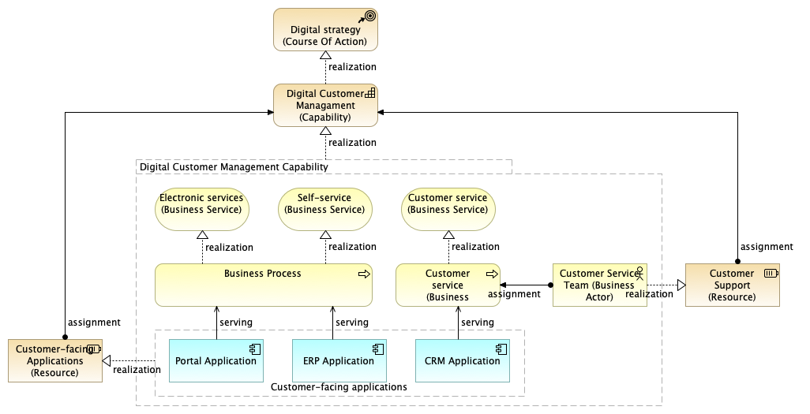
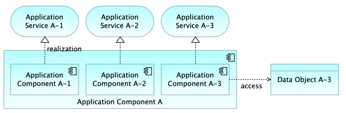
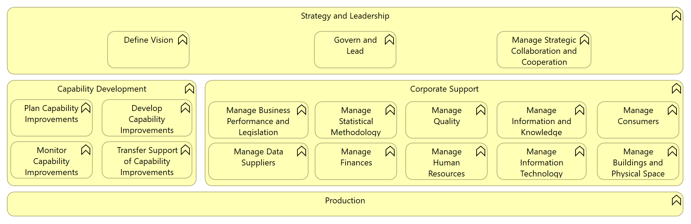
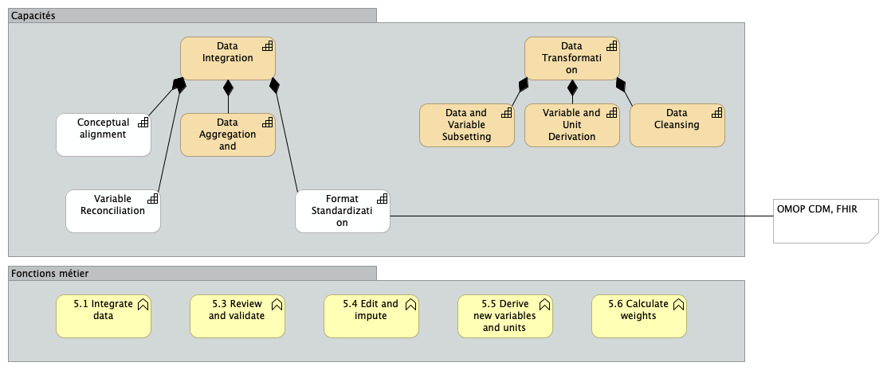
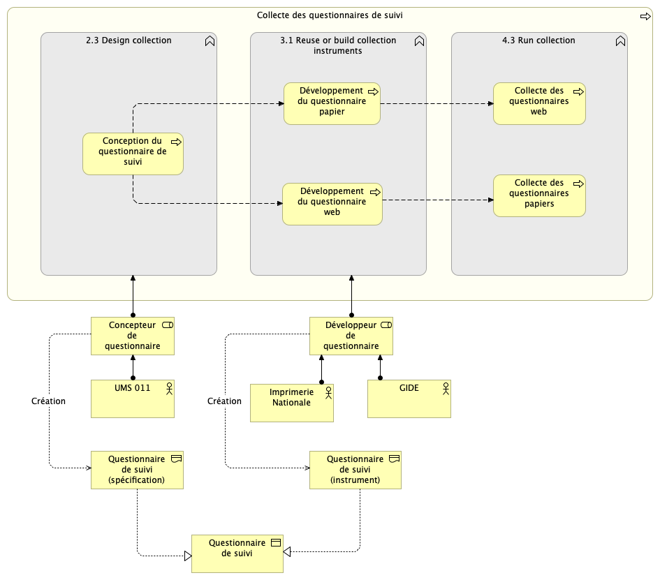

# Archimate and Moderstats models

---

## What is ArchiMate?

----

- An enterprise architecture modeling language
- Published by The Open Group and aligned with TOGAF
- Now in version 3.2 (October 2022)

Note:
ArchiMate distinguishes itself from other languages such as Unified Modeling Language (UML) and Business Process Modeling and Notation (BPMN) by its enterprise modelling scope.
The European Interoperability Reference Architecture (EIRA) uses ArchiMate (and Archi)

----

The ArchiMate framework

Note:
Passive structure: entitiy on which actions are conducted (information objects, physical devices...)
Active structure : entities that display some behavior (business actors, application components...)
Behavior refers to the processes and functions performed by the active structures

----

Example: capability planning

([source](https://www.hosiaisluoma.fi/blog/archimate/))

----

Example: application structure

([source](https://www.hosiaisluoma.fi/blog/archimate/))

----

- Archimate is relevant for ModernStats models because it covers all the scope of enterprise architecture (objectives, capabilities, actors and roles, application services, network nodes...)

- For example, CSDA is already expressed in ArchiMate

---

## What is Archi?

----

- Open source software to manage ArchiMate models
- Easily and intuitively create all ArchiMate elements, relations and views
- Initially funded by JISC (UK)
- Actively maintained: version 5.5 published in January 2025

Note:
Very easy to use
Hides some ArchiMate complexities (e.g. relations)

---

## What we did

- Motivation: use MS models to analyze information systems for customers
- Archi models created for:
  - GSBPM and GAMSO
    - using business functions
  - CSDA
    - principles
    - specialization instead of grouping

Note:
CSDA redone from scratch

----

Example: GAMSO Overview

----

## How to use the models?

- Importing in target model
  - Very convenient for reuse, but:
    - static import
    - default import behavior is a bit confusing
  - Organize MS models in folders could be a solution

Note:
"...a bit confusing" -> imported models are entirely imported and components mixed with those of target model

----

Example: target capabilities

Note:
Describe target system in terms of capabilities and business functions

----

Example: specific data collection

Note:
Represent given process in reference to the GSBPM

---

## Possible next steps

- Finalize GSBPM / GAMSO models (level of detail for textual description?)
- Consolidate CSDA model
- Review models (GSBPM / GAMSO / CSDA)
- Publish on Unece GitHub?
- Guidelines for use?
- Governance?
- GSIM?

Note:
That is if the SSG thinks the approach is interesting