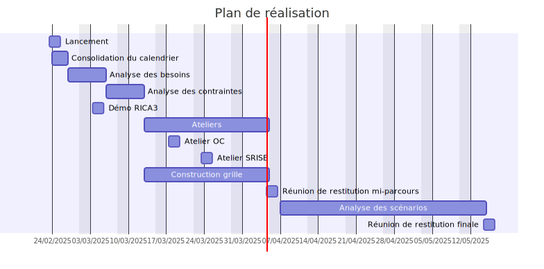

# RIDEA

**Choix de la solution de collecte**

Point d'étape - *7/4/2023*

---

## Agenda

----

- Point d'étape
- Le rapport
- Les exigences
- La grille d'analyse
- Les scénarios
- La suite

---

## Point d'étape

----

----

### Ateliers

- Offices comptables
- SRISE
- SNUM
- Insee, Ose
- BQIS
- Pôle RICA

----

### Focus ateliers

- OC / SRISE :
  - globalement satisfait
  - outils de suivi (SRISE)
  - lien vers les données comptables

----

### Focus ateliers

- Insee OSE
  - des incertitudes...
  - ...sur les développements au-delà de 2025
  - ...sur l'hébergement du RIDEA
  - mais ouverture sur la participation au développement

---

## Le rapport

----

### Présentation

➡️ 📑

Note:
Afficher le rapport, présenter le plan

---

## Les exigences

----

### Exigences fonctionnelles

- Autonomie dans la conception
  - Écrans, contrôles, référentiels
- Mobilisation de données externes
  - Administratives, N-1, comptables
- Suivi / validation
  - Circuit de validation, justifications, communication entre les acteurs

Note:
Construites et validées avec le pôle 🤝

----

### Exigences non fonctionnelles

- Sécurité
- Performance
- Utilisabilité

---

## Les scénarios

----

- TODO Scénario Insee, des modulations ?
  - participation aux développements
  - hébergement interne
- Développement spécifique
- Solution du marché
  - Liste finalisée aujourd'hui

Note:
SM - Solutions on-premise, souveraines, voire open-source
SM - Askia, Qualtrics, Formbricks

---

## La grille d'analyse

- afficher la grille, décrire la structure
- spécificités DS
- collaboration BSUPD

----

### Présentation

➡️ 🧮

----

### Précisions

- FU
  - adéquation fonctionnelle
- DS
  - mesure du coût  
- SM
  - adéquation fonctionnelle
  - coût licence
- Mesure risque / incertitude

---

## La suite

----

Note:
Cristallisation solutions SM (tout à l'heure)
Consultations (ex le pôle), pas un travail en tunnel