# RIDEA

**Choix de la solution de collecte**

Restitution - _15/5/2025_

---

## Ordre du jour

---

- Déroulement de la prestation
- Synthèse du rapport
- Détails des scénarios
- Plan d'actions

---

## Rappel sur le déroulement de la prestation

---


Note: 
Liste des entretiens

---

### Première phase

- Série d'entretiens
- Liste des exigences
  - 45 exigences fonctionnelles
  - 14 exigences non-fonctionnelles
- Précision sur les scénarios
  - Liste des éditeurs

---

## Synthèse

---

- Plusieurs scénarios pertinents
- Le choix est à faire en priorisant des critères de sélection

---

- _Scénario Insee_ : bon choix stratégique mais des incertitudes
- _Développement spécifique_ : une garantie de complétude mais un coût élevé
- _Solutions éditeurs_ : l'option la plus sûre mais nécessitant des adaptations

Note: 
Insee -> si hébergement MASA, indépendance éditeur, bonne couverture
fonctionnelle, 
Solutions -> Askia et Gide assez proches, sûr car dev spécifique
et support

---

### Évaluation

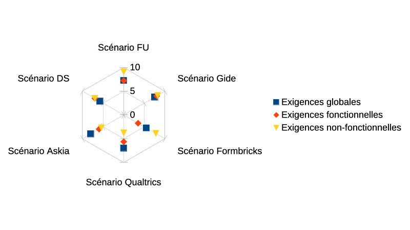

---

## Détails des scénarios

---

### Insee

---

- Trop d'incertitude sur la déclinaison "hébergement Insee" pour le RIDEA
- Un hébergement MASA est possible et rend le scénario très intéressant
- Les derniers développements et ceux à venir constituent une des meilleures
  couvertures fonctionnelles étudiées
- Un partenariat de co-développement du fonctionnel manquant (suivi) serait
  idéal mais est-il envisageable ?
  - Coût estimé à 54.000 € HT
- Quel impact sur Corn ?

Note:
Dev ou intégration d'une solution de workflow

---

### Développement Spécifique

---

- La perspective d'aboutir à la couverture exacte des besoins...
- ...mais à un coût élevé, sur le plan financier mais aussi sur la charge de
  pilotage pour le pôle
- Deux estimations entre 992.000 € et 1.473.500 € (coût initial + maintenance sur 5
  ans)

---

### Solutions du marché

- Askia et Gide : deux très bonnes options
- Des solutions logicielles éprouvées
  - Très complètes sur les aspects de collecte (CAWI et CAPI)
  - Des limites sur les capacités de suivi
- Du service de développement
- Estimation des coûts sur cinq ans
  - Askia, 274.350 € HT
  - Gide, +500.000 € HT

Note: 
Qualtrics -> cloud et limites fonctionnelles 
Formbricks -> trop jeune et limites fonctionnelles 
Gide -> 465.000 sans l'intégration d'un moteur de workflow 

---

## Retours sur les exigences

---

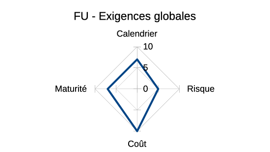
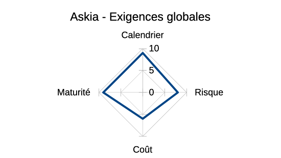
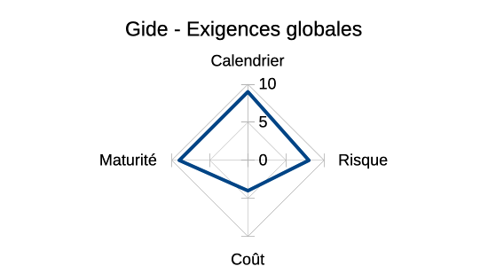
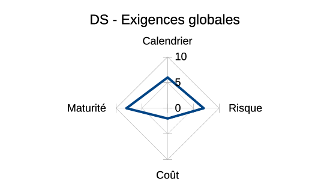

---

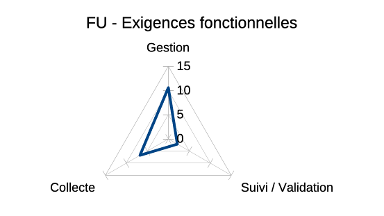
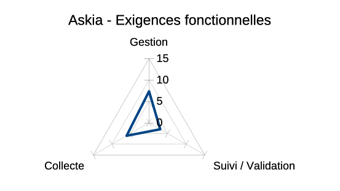
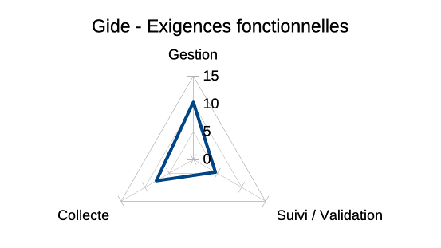

---

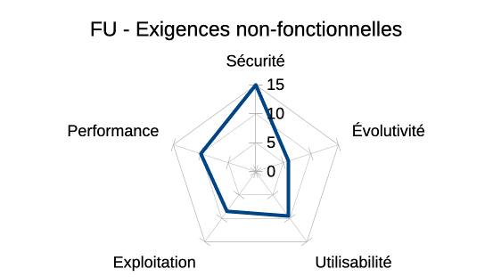
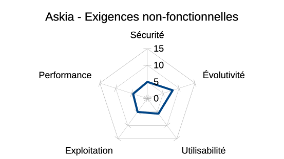
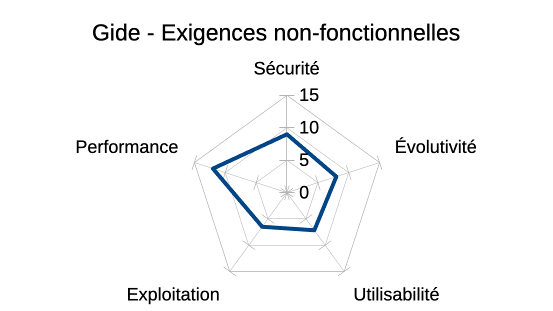

---

## Amorce de plan d'actions

---

- Rédiger un cahier des charges
- Engager une discussion de haut niveau avec l'Insee sur une possible contractualisation
- Mener une étude de risques plus détaillée
- Creuser l'utilisation des schémas de données comptables
- Étudier un double scénario court / long terme
- Demander un MVP sur les outils d'éditeurs

Note:
Cahier des charges -> Plan de continuité
Double scénario : éditeurs puis Insee

