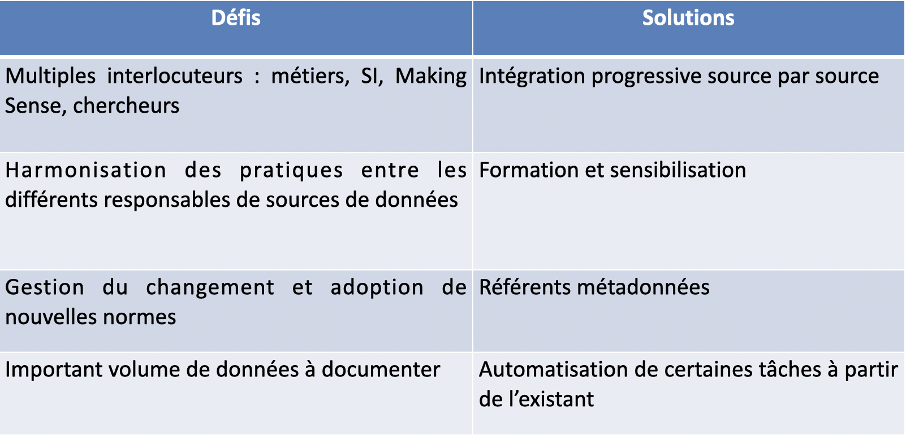
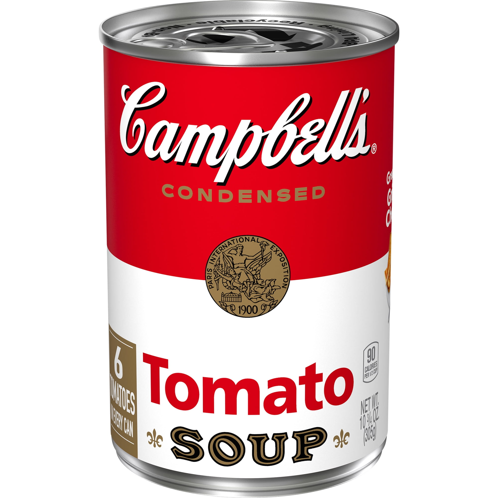
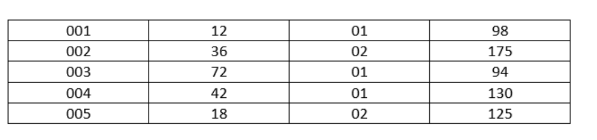
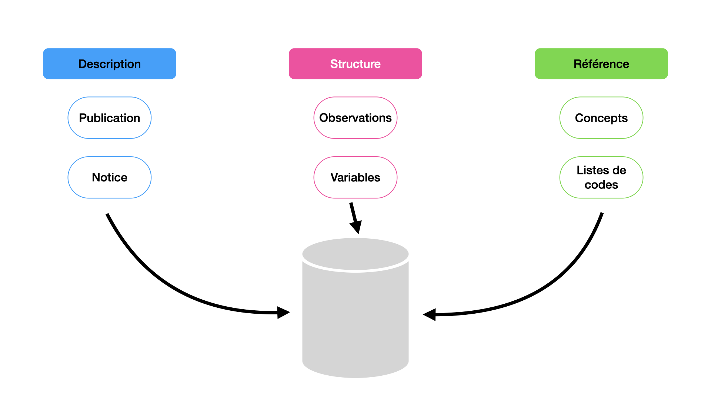
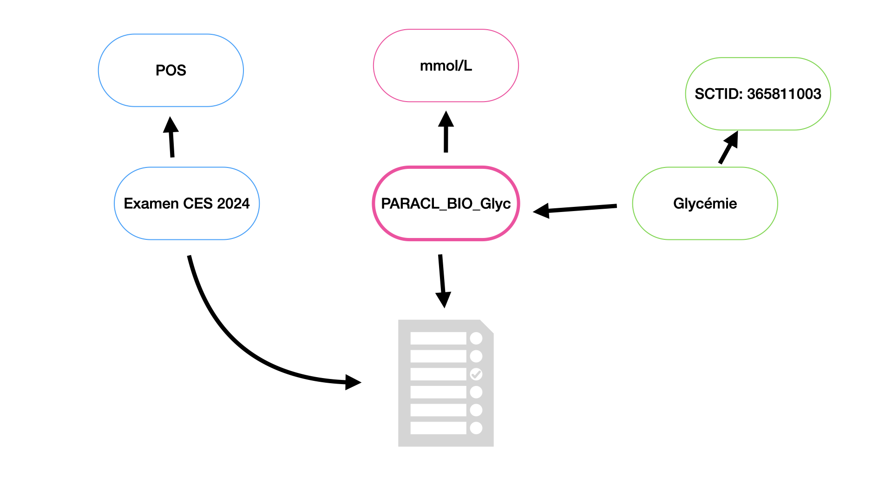

## Présentation du projet Mekong

**Métadonnées pour Constances**

_4 juin 2025_

---

## Plan

- Objectifs
- Métadonnées
- Le projet Mekong
- Point d'étape
- La suite

---

## Objectifs

_Valorisation du patrimoine de données & métadonnées FAIR_

---

### Contexte

- La cohorte Constances s’inscrit sur le long terme
- Un patrimoine de données extrêmement riche (plus de 10 000 variables –
  métadonnées incluses) et qui ne cesse de croître
- Une grande diversité des sources de données (questionnaires, biologie,
  SNDS...)

---

### Contexte

Une documentation de référence existe mais :

- Déclinée sous différents formats (Word, PDF …)
- Évolutions et suivi longitudinal complexes
- Description des statistiques et nettoyages sur plusieurs outils (STETHOSCOPA,
  AQUEDUC)
- Maintien sur le long terme complexe et risque de perte d’informations ou
  d’expertises
- Information complète à 360° pas toujours accessible aux chercheurs

---

### Besoin

_Une documentation des données précise, structurée et pérenne_

---

#### Pourquoi renforcer la documentation des données ?

_Pour une utilisation plus efficace par les chercheurs_ :

- Accroître l’accessibilité des données
- Favoriser l’interprétation-compréhension correcte des variables en s’appuyant
  sur une vision à 360° : évolutions longitudinales, procédures de
  contrôle/nettoyage et statistiques descriptives

---

#### Pourquoi renforcer la documentation des données ?

_Pour une meilleure visibilité internationale_ :

- Répondre aux attentes de la communauté scientifique internationale sur la
  standardisation
- Soutenir la réutilisation et l’interopérabilité
- Se préparer au mieux à l’Espace européen des données de santé

---

### La solution mise en œuvre

➡️ Adoption de la norme DDI (Data Documentation Initiative) dans Constances

---

### La solution mise en œuvre

- Norme ouverte, reconnue, largement adoptée (DDI Alliance : Insee, CASD,
  CLOSER, …)
- Flexible et extensible à tous types de données (questionnaires, biologie ...)
- Couvre tout le cycle de vie de la donnée : de la conception à l’archivage
- Documentation pérenne

---

### Le projet

- Soutenu par France 2030
- Collaboration avec Making Sense
- S’intègre dans la gouvernance des données de CONSTANCES
- _Objectif_ : _centraliser la documentation des données et métadonnées en
  suivant la norme DDI et accroitre la complétude des catalogues de données
  documentés en DDI_

---

### Périmètre

La documentation concernera, progressivement, les données :

- **auto-déclarées** : questionnaires d’inclusion et de suivi
- **des examens de santé** : paracliniques, biologiques, neuro-psychologiques
  (45+)
- **des bases administratives** : SNDS (consommation de soins de santé) et Cnav
  (emploi, retraite, revenus)

---

### Périmètre

- **environnementales**: géocodes résidentiels permettant un appariement aux
  bases de données environnementales (qualité de l’air, espaces verts, qualité
  de l’eau…)
- **professionnelles** : calendriers professionnels permettant un appariement à
  des MEE
- **de la biobanque** : échantillons biologiques

---

### Bénéfices

- Respect des standards FAIR
  - Données faciles à trouver, accessibles, interopérables et réutilisables
- Exploration facilitée des données : vision à 360°
- Gain de temps pour les équipes et chercheurs
- Meilleure qualité des données et réduction des erreurs

---

### Bénéfices

- Favorise l’interopérabilité avec d’autres systèmes
  - Espace européen des données de santé …
- Améliore la collaboration nationale et internationale

---

### Défis pour l'équipe

---

### Un levier stratégique

- Investissement dans la qualité et la durabilité des données
- Aligne CONSTANCES avec les meilleures pratiques en matière de gestion et de
  structuration des métadonnées (se rapprocher d’une vision à 360°)

---

### Un levier stratégique

- Renforce la valorisation scientifique du patrimoine de données et métadonnées
  (meilleure exploitation des données longitudinales)
- Positionne l’équipe au cœur de l’écosystème FAIR

---

## Métadonnées

_C'est quoi une métadonnée ?_

---

---

---

---

---

### Différents types de métadonnées

- Descriptives
- Structurelles
- Référentielles

---

---

Note: Snomed CT ID 365811003 -> "constatation concernant le taux de glucose"

---

### FAIR

- Findable, Accessible, Interoperable, Reusable
- Centrés sur la prise en main par les systèmes automatiques (_machines_)
- Rendus possibles par les métadonnées

Note: Principes pour la gestion et la publication de données scientifiques

---

### Standards

- Plutôt que de concevoir des schémas de métadonnées spécifiques, utilisation de
  standards
- Notre initiative centrée sur les produits DDI (Lifecycle, CDI) mais pas
  uniquement (DCAT, VTL)
- Participation aux communautés

---

<h2 style="margin-top: 30vh;">Mekong</h2>

Note: présentation du projet

---

### Vision stratégique

- Rendre les métadonnées actives
- Mettre l’utilisateur au centre
- Développer l'ouverture

---

### Activités

- Développement du système d’information au travers des cas d’usages
- Construction de la plateforme de métadonnée
- Formation de l’équipe Constances sur les standards
- Communication sur le projet

---

### Organisation projet

- Équipe mixte MS x EC
- Points hebdomadaires
- Copil bimestriel
- Costrat semestriel

---

### L'équipe

- **Constances** :
  - Opérationnels : Adeline Renuy, Constance Yvon, Sofiance Kab
  - Direction : Marie Zins, Antoine Duclos
  - IT : Stéphane Le Got, Ghilès Meddour
- **Making Sense** : Franck Cotton, Nicolas Laval, Romain Tailhurat

---

## Point d'étape

---

### Phase d'initialisation

- Analyse du processus métier
- Étude d'architecture fonctionnelle et applicative

---

### Pivot

- "Montrer" des résultats concrets plus rapidement
- Décision de prototype un explorateur de métadonnées

---

### Explorateur de métadonnées

_Prototype en trois phases_

1. À partir d'un sous-ensemble de questionnaires : variables, questionnaires,
   questions, concepts (Maelstrom) - juillet 2025
2. Liens variables / concepts, enrichissement concepts, longitudinalité -
   octobre 2025
3. Nouvelles sources de données (SNDS) - décembre 2025

🔄 _Validations utilisateurs_

---

### Formation

- Introduction à DDI Lifecycle les 17 et 18 juin
- Première étape d'une transmission des savoirs

---

## Prochaines étapes

- Court terme
  - Retours chercheurs
  - Itération
- Moyen terme
  - Suite explorateur
  - Collaborations (Closer, Sciences Po CDSP, CASD)
  - EDDI25
  - Architecture du SI
