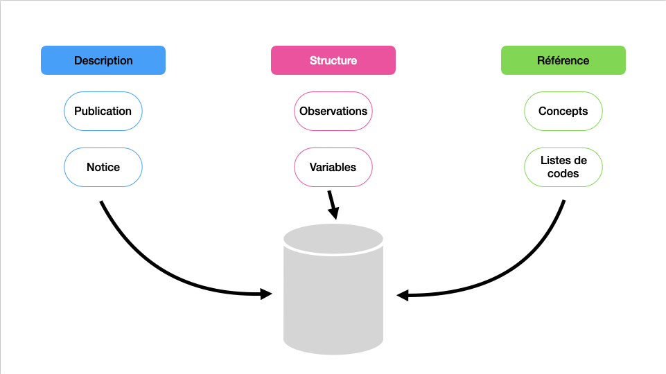

# Présentation du projet Mekong

## Métadonnées pour Constances

_4 juin 2024_

---

## Objectifs

- Créer et gérer la métadonnée
- Via des standards reconnus
- Dans une perspective FAIR

...France 2030... ...Collaborations...

---

## Métadonnées

_C'est quoi la métadonnée ?_

---

---

---

---

---

### Différents types de métadonnées

- Descriptives
- Structurelles
- Référentielles

---

---

### FAIR

---

### STANDARDS

---

<h2 style="margin-top: 30vh;">Mekong</h2>

Note: présentation du projet

---

## Point d'étape

...

---

## Prochaines étapes

...
