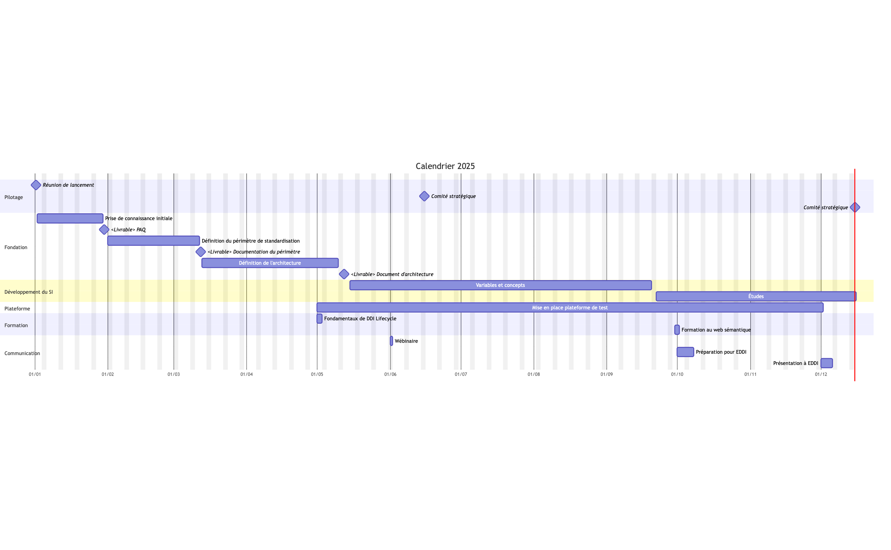
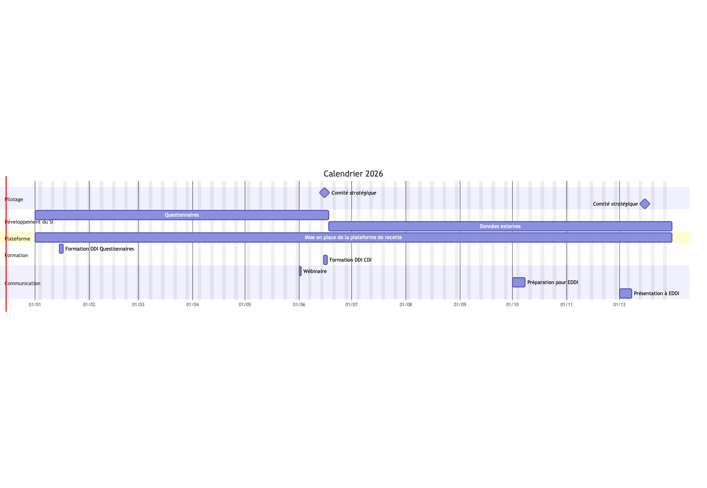

# Mekong

**Comité stratégique**

_15/12/2025_

---

## Agenda

- Bilan 2025
- Feuille de route 2026
- Portail chercheur
- Administratif

---

## Bilan 2025

----

### Explorateur

- Rappel
  - Recette utilisateurs durant l'été
  - Des améliorations nécessaires
- Phase 2
  - Classement thématique
  - Point d'entrée par questionnaire

➡️ [démo](https://mekong.colectica.org)

----

### Explorateur

- Deux suites possibles :
  - Nouvelle recette utilisateurs (ouverte plus largement) ?
  - Nécessité d'une amélioration de l'interface graphique
    - Adaptation de Colectica Portal ?
    - Développement ad hoc ?
- Portail interne ou externe (cf. lien avec le portail "Chercheurs") ?

Note:
Publicité aux précédents testeurs
Recette si UI

----

### Retour sur le planning initial

----

### Retour sur le planning initial

- Réalisation assez conforme, bien que pivot sur l'explorateur
  - 👀 Architecture
  - 👀 Études / partie haute 
    - Travaux sur les univers
- Plan de formation
  - 👀 2ème session "DDI pour les questionnaires" ?

----

### Collaboration, communication

- _Institutionnelles_
  - Insee, Bauhaus, module Variables
  - CDSP, FAIRwDDI 
  - CASD, expositions
    - Document d'architecture
- _Univers DDI_
  - WG sur les questionnaires
  - Freddi
  - EDDI 25
    - Implication France Cohortes

----

### Collaboration, communication

- _Comitologie_
  - Points hebdomadaires et ponctuels satisfaisants
  - Comités de pilotage et stratégique
    - Rythme ?
    - Participants ?

---

## Feuille de route 2026

----

### Planning initial

----

### Priorisation

Trois sujets possibles à poursuivre ou développer:

- la conception de l'architecture fonctionnelle et applicative,
- l'explorateur de métadonnées,
- des expérimentations des possibilités de l'IA

----

#### Priorisation, architecture

- Documenter les processus métiers qui produisent ou consomment des métadonnées
- Identifier les besoins applicatifs (développements ou évolutions)

----

#### Priorisation, explorateur

- Cf. points vus précécemment
 - Recette phase 2
 - Amélioration ou développement UI

----

#### Priorisation, IA

- Poursuivre les travaux déjà commencés
- Identifier d'autres cibles
- Mettre en place des collaborations (Closer, FAIRwDDI)

----

### Renouvellement Colectica

- L'abonnement actuel s'achève en avril 2026
- Reconduction ?
  - Hébergement ?
  - Installation ?
- Si non, développement ad hoc
  - Travaux architecture

----

### Collaboration, communication

- Closer
  - Séminaire janvier
- France Cohortes / Fresh
  - Collaboration plus rapprochée dans l'usage des standards
- CASD
- DDI Alliance
  - Q²
  - MPAWG

Note:
- DDI pour les données de santé

---

## Portail chercheurs

- Reprise du projet ?
  - Quelle couverture fonctionnelle ?
  - Quelle articulation avec Mekong ?

---

## Administratif

- Point budgétaire
- Suivi des jours
- Facturation mars
- Point prochaines réunions

----

### Budget

- Consommation 2025 : 250.000€
- Reste : 626.000€
  - Répartition par an :  ~208.700€

----

### Suivi des jours

- Jours 2025: débordement jusqu'à mi-janvier
- Prochaine facturation fin mars

----

### Prochaines réunions

- Fin février : comité de pilotage
- Fin avril : comité de pilotage
- Mi-juin : comité stratégique