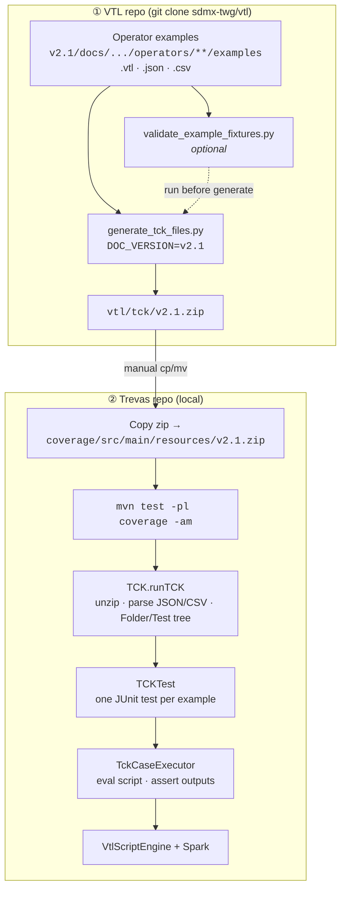
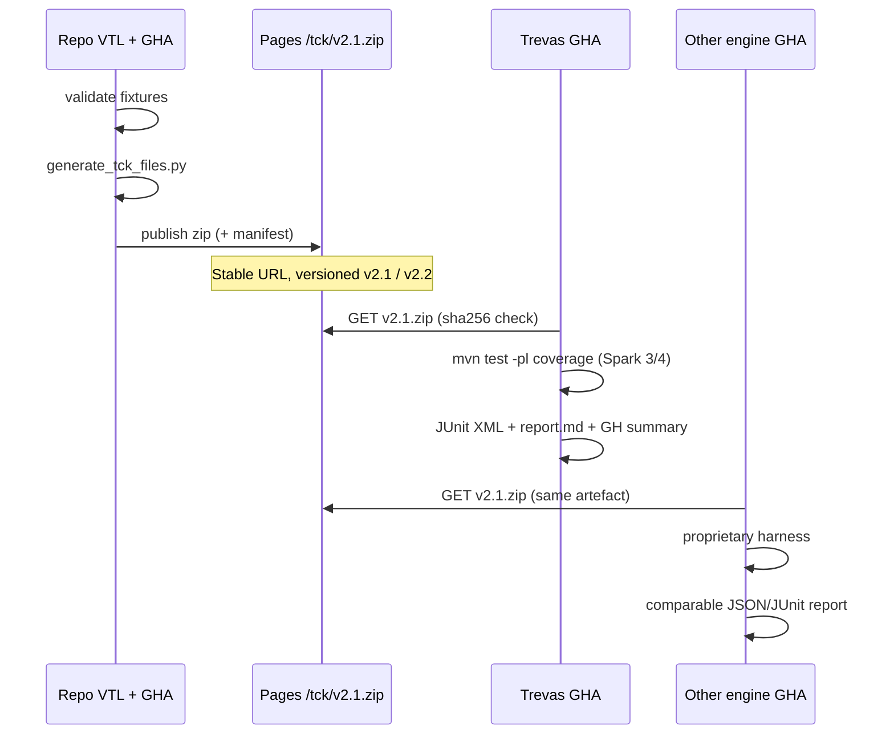

# Trevas

**VTL Task Force - Malakoff**

_28/05/2026_

---

## What's new?

- Spark 4
- Local TCK

---

## Spark 4

### Why?

- Faster query execution
- Reduced infrastructure costs
- Improved stability and security
- Modernized dependencies and modular APIs

--

## Spark 4...

#### ...contributors

### Who?

- Bundesbank
- Making Sense
- Hadrien K.

--

## Spark 4...

#### ...while maintaining Spark 3

### How?

- modularization
- ANTLR shading (conflicting version in Spark 3/4)

--

## Spark 4...

#### ...under review

### When?

- merged in develop
- released soon

---

## Trevas - TCK

#### Local workflow



--

## Trevas - TCK

#### Zip content

```txt
{Operator category}/{Operator name}/{example_name}/
  transformation.vtl
  input.json
  DS_1.csv, DS_2.csv, ...
  output.json
  DS_r.csv
```

--

## Trevas - TCK

#### Input/Output example

```json
{
  "datasets": [
    { "name": "DS_1", "structure": "DS_1" }
  ],
  "structures": [
    {
      "name": "DS_1",
      "components": [
        { "name": "Id_1", "role": "Identifier", "data_type": "TimePeriod" },
        { "name": "Me_1", "role": "Measure", "data_type": "Integer" }
      ]
    }
  ]
}
```

--

## Trevas - TCK

Output published on [Github](https://github.com/InseeFr/Trevas/actions/runs/26083480157)

--

## Trevas - TCK

_Writing code and tests inevitably leads to mistakes; having a shared, robust TCK helps uncover issues that would otherwise go unnoticed._

Thanks to TCK we solved "quickly" around 20 tests.

--

## Trevas - TCK

#### Current situation

- **Fixture / TCK zip (17)** → Time issues
- **Missing operator (~25)** → Sets, pivot, validation, Spark analytics
- **Structural mismatch (~14)** → Aggregation, Join, types
- **Data row mismatch (2)** → Join ex_6, ex_7
- **Execution bugs (~13)** → NPE, DS rules, time engine

--

## Shared TCK?

#### VTL repo workflow proposal



[Dedicated GH issue](https://github.com/sdmx-twg/vtl/issues/661)

---

## Next steps

- Continue to inspect TCK results to fix/improve Trevas
- Explore the possibility of creating a vtl-ddi module (sponsored by CASD)
- Develop support for unsupported operators if we have use cases